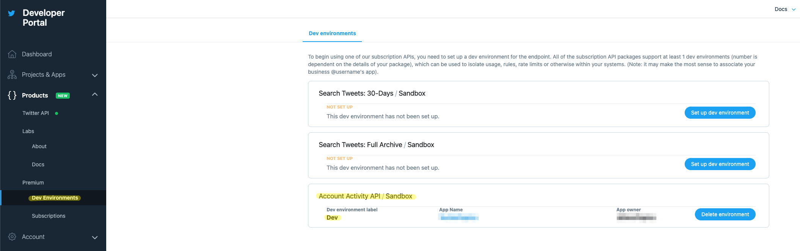
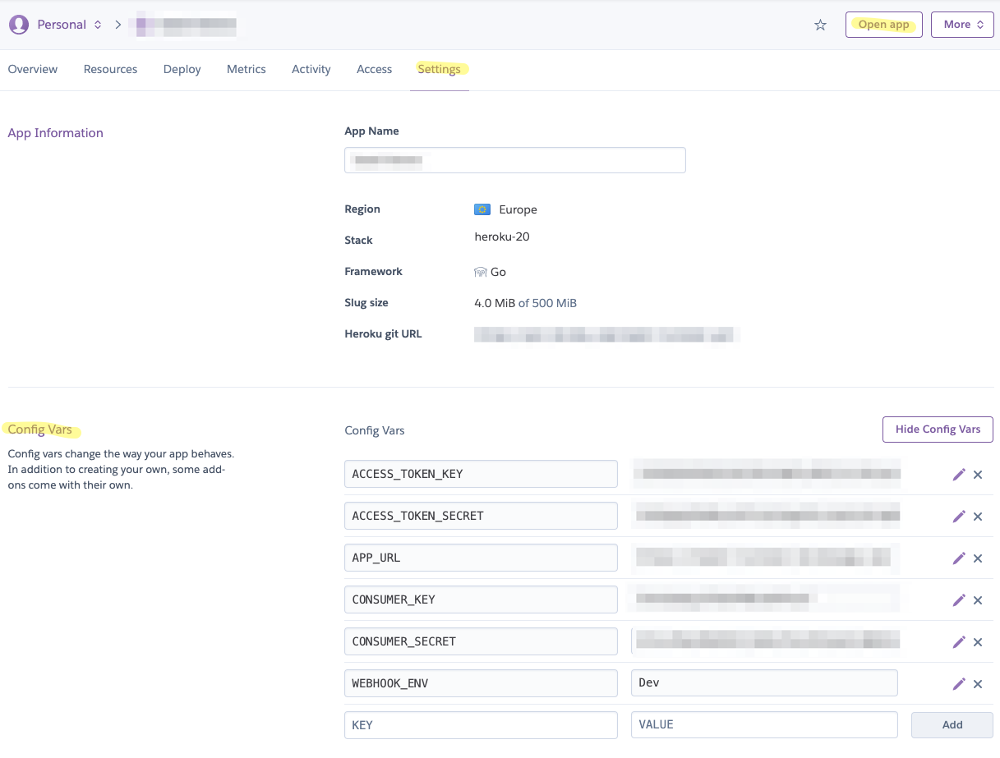
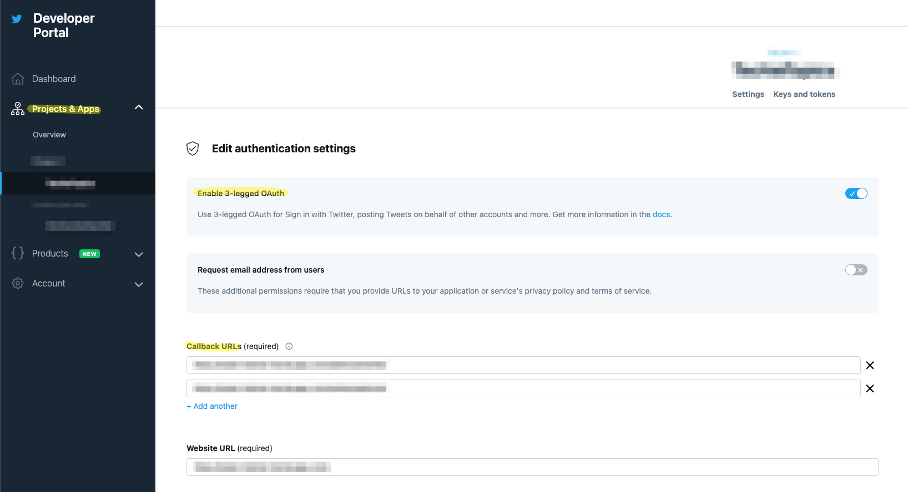
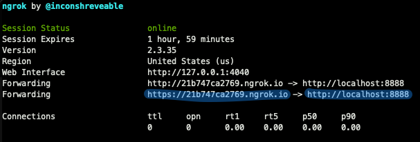

Twitter Go Bot
---

A simple bot in Golang that will reply to any mention with a "hello".

## How to use it?

This guide assumes that you have a [developer account on Twitter](https://developer.twitter.com/en) and an App with its keys & tokens at hand.

Your Twitter App will need to have access to "Read + Write + Read and post direct messages". Make sure you have those permissions before creating your keys & tokens.

To make this bot listen for mentions you will need access to the **Account Activity API**. To enable that you need to go `Dev Environments` and Set up your environment.



It will ask you what label to use for your environment. In the screenshot the label is `Dev`. We will need this value later.

## Deployment

### On Heroku

Just use the deployment button [](https://heroku.com/deploy) and it will not work 😅 until you set the environment variables.



So for `APP_URL` just use the URL that the `Open app` button at the top right has. It will be something like `https://[your-heroku-app-name].herokuapp.com`

For `ACCESS_TOKEN_KEY`, `ACCESS_TOKEN_SECRET`, `CONSUMER_KEY`, `CONSUMER_SECRET` put your Twitter App keys & tokens.

For `WEBHOOK_ENV` you put the label you set to your Twitter environment. In my case was "Dev" (it's on the first screenshot).

Done? Not yet, but almost there... Now you need to whitelist your heroku app URL for Twitter's callback. So add your heroku app URL with `/webhook/twitter` path as a callback URL and since Website URL is required, just add the same URL without the path. For example:

- Callback URL: `https://[your-heroku-app-name].herokuapp.com/webhook/twitter`

- Website URL:  `https://[your-heroku-app-name].herokuapp.com/`



Now go a test it! Just mention your bot, and it will reply to your tweet saying "hello" 😁

### On Local

Twitter doesn't like callbacks to `localhost` so we will be using [ngrok](https://ngrok.com/download) to make it work. So first run:

```
./ngrok http 8888
```



You will need the **https URL** for the `APP_URL` environment variable. Now, go and replace the environment variables on `docker-compose.yml`

```
CONSUMER_KEY=[YOUR_TWITTER_API_KEY]
CONSUMER_SECRET=[YOUR_TWITTER_API_KEY_SECRET]
ACCESS_TOKEN_KEY=[YOUR_TWITTER_ACCESS_TOKEN_KEY]
ACCESS_TOKEN_SECRET=[YOUR_TWITTER_ACCESS_TOKEN_KEY_SECRET]
WEBHOOK_ENV=[YOUR_TWITTER_SANDBOX_ACCOUNT_ACTIVIY_ENVIRONMENT] # Here is where you put the label you set to your environment. In my case was "Dev"
APP_URL=[YOUR_NGROK_HTTPS_URL]
PORT=8888
```

Almost there... Now you need to whitelist the ngrok URL for Twitter's callback. So add your ngrok URL with `/webhook/twitter` path as a callback URL and since Website URL is required, just add the same URL without the path. For example:

- Callback URL: `https://[ngrok_id].ngrok.io/webhook/twitter`

- Website URL:  `https://[ngrok_id].ngrok.io/`


Finally... Now just run `docker-compose up` and our bot is listening for mentions. Feel free to go and try it 😁
